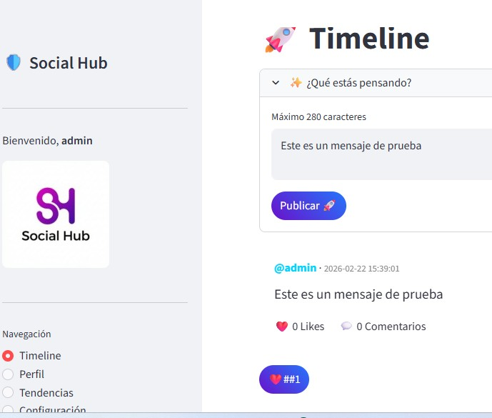

<div align="center">


# 🛡️ SOCIAL HUB: Red Social Minimalista & Segura

[](https://github.com/)
[](https://www.python.org/)
[](https://streamlit.io/)
[](https://github.com/)
[](https://www.apache.org/licenses/LICENSE-2.0)
[](https://www.microsoft.com/windows)

</div>

<div align="center">

</div>

---

### 🌟 Memorial del Proyecto: La Revolución del Microblogging Seguro

**Social Hub** no es solo una aplicación; es un ecosistema de comunicación diseñado bajo los estándares más estrictos de **Ciberseguridad (CONF23-STD-SDLC)**. Este proyecto representa la convergencia entre una experiencia de usuario **Premium (Glassmorphism)** y un núcleo robusto de **Ingeniería de Software**.

---

### 📋 Índice de Documentación (Memoria Técnica)

Navega por la arquitectura y planificación del proyecto a través de sus documentos oficiales:

| Documento | Descripción | Enlace |
| :--- | :--- | :---: |
| **DOC01 - CONOPS** | Concepto de Operaciones y Estrategia | [📄 Leer](./docs/specifications/DOC01_CONOS_Concept_of_Operations.md) |
| **DOC02 - BRS** | Requerimientos de Negocio y Mercado | [📄 Leer](./docs/specifications/DOC02_BRS_Business_Requirements_Specification.md) |
| **DOC03 - StRS** | Necesidades de los Stakeholders | [📄 Leer](./docs/specifications/DOC03_StRS_Stakeholder_Requirements_Specification.md) |
| **DOC04 - SyRS** | Especificaciones del Sistema | [📄 Leer](./docs/specifications/DOC04_SyRS_System_Requirements_Specification.md) |
| **DOC05 - SRS** | Requerimientos Críticos de Software | [📄 Leer](./docs/specifications/DOC05_SRS_Software_Requirements_Specification.md) |
| **DOC06 - ADR** | Registro de Decisiones Arquitectónicas | [📄 Leer](./docs/architecture/DOC06_ADR_Architectural_Design_Records.md) |

---

### 🎨 Visual Showcase (Preview)

<div align="center">

<p><i>Interfaz principal de Social Hub con diseño Dark Mode y Glassmorphism</i></p>
</div>

---

### 🚀 Capacidades Core del Sistema

- 📝 **Micro-interacción**: Publicaciones de 280 caracteres con hilos de conversación.
- ⚡ **Reactividad Total**: Timeline infinito con actualización asíncrona mediante `st.session_state`.
- 💾 **Persistencia SQL**: Motor SQLite3 con integridad referencial y migraciones automáticas.
- 🛡️ **Blindaje OWASP**: Protecciones activas contra SQLi y XSS siguiendo el estándar 2025.
- 🎨 **Estética Neo-Digital**: UI diseñada con degradados HSL y desenfoque gaussiano de fondo.

---

### 🛠️ Despliegue Automatizado (Zero-Touch)

Para instalar el entorno, las dependencias y lanzar la plataforma:

```powershell
# Clonar y ejecutar el instalador automatizado
.\build.cmd
```

---

### 📂 Anatomía del Repositorio

```text
📁 SOCIAL_HUB/
│
├── 📁 assets/              # Identidad Visual y Multimedia
│   └── 🖼️ logo.png         # Logo Oficial Social Hub
│
├── 📁 core/                # Cerebro del Sistema (Lógica de Negocio)
│   └── ⚙️ services.py      # Capa de abstracción de servicios
│
├── 📁 database/            # Capa de Datos (Data Lake Local)
│   ├── 🗄️ social_hub.db    # Base de datos SQLite
│   └── 🐍 db_manager.py     # Gestor de transacciones y esquemas
│
├── 📁 docs/                # Gobernanza y Documentación (Memoria)
│   ├── 📁 architecture/    # Decisiones estratégicas (ADRs)
│   ├── 📁 scrum/           # Artefactos Agile (Product/Sprint Backlogs)
│   └── 📁 specifications/  # Ingeniería de Requerimientos (DOC01-05)
│
├── 📁 src/                 # Componentes de UI y Lógica Circular
├── 📁 utils/               # Utilidades de Seguridad y Validadores
│
├── 📄 build.cmd            # Pipeline de construcción automatizado
├── 📄 main.py               # Punto de entrada (Frontend Streamlit)
├── 📄 requirements.txt     # Manifiesto de dependencias
└── 📄 README.md            # Índice Maestro y Memoria del Proyecto
```

---

### 🛡️ Matriz de Cumplimiento CONF23

| Estándar | Mitigación Implementada | Estado |
| :--- | :--- | :---: |
| **OWASP A03:2025** | Parámetros de consulta SQL para evitar inyección | ✅ |
| **OWASP A01:2025** | Control de acceso basado en sesión única | ✅ |
| **ISO 27001** | Integridad de datos y logs de sistema estructurados | ✅ |
| **Pep 484/526** | Tipado estático estricto en lógica central | ✅ |

---

<div align="center">
<b>Social Hub v1.0</b><br>
<i>"Desarrollando el futuro de la comunicación segura"</i><br>
<b>© 2026 CONFIANZA23 - Senior DevSecOps Architect</b><br>

</div>
